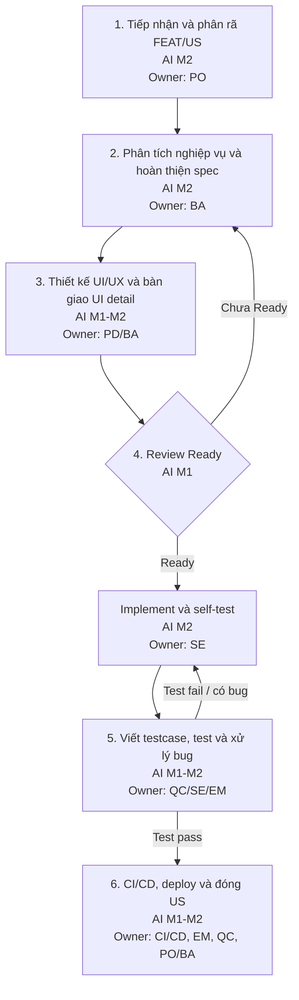

# Quy trình Delivery FEAT/US trong Sprint - 6 bước

## Mục đích

Tài liệu này tóm tắt quy trình delivery một FEAT/US trong Sprint thành 6 bước nhỏ, từ lúc tiếp nhận yêu cầu đến khi hoàn tất US. Mỗi bước thể hiện rõ vai trò chính, đầu ra, mức độ sử dụng AI và người xác nhận cuối cùng.

Nguyên tắc chính: **AI hỗ trợ tăng tốc và chuẩn hóa đầu ra, nhưng không thay thế trách nhiệm của người phụ trách.**

## Mục tiêu cần đạt

- Chuẩn hóa cách team tiếp nhận, phân tích, thiết kế, phát triển, kiểm thử, deploy và đóng FEAT/US trong Sprint.
- Làm rõ trách nhiệm của từng vai trò: PO, BA, PD, EM/Scrum Master, SE, QC và CI/CD.
- Đảm bảo US chỉ được đưa vào implement khi đã đạt Definition of Ready.
- Đảm bảo US chỉ được đóng khi đã đạt Definition of Done.
- Giảm rủi ro hiểu sai scope, thiếu AC, thiếu business rule hoặc thiếu dependency.
- Tăng chất lượng đầu ra của BA, PD, SE và QC thông qua checklist, review và handoff rõ ràng.
- Giảm bug, giảm rework, giảm vòng lặp fix/retest và tăng khả năng dự đoán tiến độ.
- Minh bạch mức độ sử dụng AI trong từng bước để team biết bước nào đang làm thủ công, bước nào có AI hỗ trợ và bước nào có thể chuẩn hóa bằng template/workflow.
- Giữ nguyên trách nhiệm xác nhận cuối cùng của con người đối với mọi đầu ra do AI hỗ trợ tạo ra.
- Giúp EM/Scrum Master theo dõi blocker, kiểm soát luồng xử lý US và đề xuất cải tiến sau mỗi Sprint.

## Cách AI tự động hóa để đạt mục tiêu

AI được dùng như một lớp tự động hóa hỗ trợ quy trình, không phải một bước thay thế con người. Mỗi mục tiêu trong quy trình cần được gắn với một cơ chế AI cụ thể: trigger đầu vào, hành động tự động, đầu ra chuẩn hóa và người xác nhận cuối cùng.

| Mục tiêu | Cách AI tự động hóa | Đầu ra AI hỗ trợ | Điểm kiểm soát của con người |
|---|---|---|---|
| Chuẩn hóa tiếp nhận FEAT/US | AI đọc yêu cầu đầu vào, phát hiện thiếu problem, goal, scope, priority, dependency và đề xuất câu hỏi làm rõ theo template. | Draft FEAT/US, danh sách thông tin thiếu, đề xuất phân rã US. | PO xác nhận scope, priority và quyết định đưa vào backlog/Sprint. |
| Đảm bảo Definition of Ready | AI đối chiếu US với checklist DoR trước khi implement, tự đánh dấu hạng mục đạt/chưa đạt và nêu blocker. | Báo cáo Ready/Not Ready, checklist DoR, danh sách việc cần bổ sung. | EM/SE/QC review và quyết định US có được implement hay không. |
| Giảm thiếu AC, rule và edge case | AI phân tích spec, business flow và UI để gợi ý AC Given/When/Then, business rule, exception và edge case còn thiếu. | Draft `spec.md`, AC bổ sung, rule/edge case cần xác nhận. | BA và PO xác nhận tính đúng nghiệp vụ. |
| Giảm suy đoán khi thiết kế và implement | AI map AC sang UI state, validation, message, data field, permission và technical task. | Draft `ui-detail.md`, checklist UI state, gợi ý task breakdown cho SE. | PD/BA xác nhận UI; SE xác nhận hướng implement. |
| Tăng chất lượng code và giảm rework | AI hỗ trợ sinh task kỹ thuật, review code theo AC, phát hiện thiếu self-test, thiếu validation hoặc sai rule trước khi bàn giao QC. | Review note, self-test checklist, gợi ý fix trước khi merge. | SE reviewer và EM xác nhận code đủ điều kiện bàn giao. |
| Tăng độ phủ kiểm thử | AI sinh testcase từ AC/rule/UI state, phân loại positive/negative/permission/integration/edge case và phát hiện testcase thiếu. | Testcase draft, test scope, checklist coverage. | QC xác nhận testcase chính thức và kết quả test. |
| Rút ngắn vòng lặp bug/retest | AI chuẩn hóa bug report, gợi ý severity, phân tích nguyên nhân khả dĩ, phạm vi ảnh hưởng và testcase cần retest. | Bug report đầy đủ, impact note, retest checklist. | EM/SE/QC xác nhận severity, root cause và kết quả retest. |
| Kiểm soát deploy và đóng US | AI tổng hợp trạng thái CI/CD, test result, bug còn mở, smoke test và DoD để gợi ý có thể đóng US hay chưa. | Báo cáo DoD, release note ngắn, danh sách điều kiện chưa đạt. | EM/QC/PO/BA xác nhận Done và quyết định đóng US. |
| Cải tiến sau Sprint | AI tổng hợp blocker, bug pattern, rework, hạng mục DoR/DoD hay bị fail và đề xuất cải tiến workflow/template. | Sprint improvement note, action item, đề xuất cập nhật checklist/prompt. | EM/Scrum Master chọn action item đưa vào cải tiến quy trình. |

Luồng tự động hóa nên vận hành theo nguyên tắc:

- **Trigger rõ ràng:** AI chỉ chạy khi có sự kiện cụ thể như tạo US, cập nhật spec, chuyển trạng thái Ready, tạo PR, tạo bug, CI/CD hoàn tất hoặc chuẩn bị đóng US.
- **Template hóa đầu ra:** Mọi kết quả AI tạo ra phải đi vào tài liệu hoặc checklist chuẩn như `spec.md`, `ui-detail.md`, DoR checklist, testcase, bug report, self-test checklist hoặc DoD checklist.
- **Có trạng thái kiểm soát:** Kết quả AI nên thể hiện rõ `Đạt`, `Chưa đạt`, `Thiếu thông tin`, `Cần người xác nhận` thay vì chỉ trả lời dạng mô tả.
- **Human-in-the-loop:** AI có thể draft, review, đối chiếu và gợi ý quyết định, nhưng PO/BA/PD/EM/SE/QC vẫn là người xác nhận cuối cùng theo vai trò.
- **Tự động hóa tăng dần:** Bắt đầu từ `AI M1` cho từng thao tác riêng lẻ, chuẩn hóa thành `AI M2` bằng template/workflow, sau đó mới nâng lên `AI M3` với trigger tự động và dashboard giám sát.

## Khó khăn hiện tại

- Yêu cầu đầu vào có thể chưa rõ problem, goal, scope, priority hoặc dependency nhưng vẫn được đưa vào phân tích hoặc implement.
- FEAT/US có thể chưa được phân rã đủ nhỏ, dẫn đến estimate khó, scope lớn và khó hoàn tất trong Sprint.
- Spec nghiệp vụ có thể thiếu business flow, business rule, data, AC Given/When/Then hoặc edge cases.
- UI/UX có thể chưa đủ state, validation, message, empty/loading/error hoặc chưa map rõ với AC, khiến SE và QC phải suy đoán.
- Review sản phẩm BA/PD có thể chưa có kết luận rõ ràng, feedback chưa được cập nhật hoặc tài liệu chưa được lưu đúng nơi.
- Review US có thể diễn ra muộn hoặc thiếu sự tham gia của QC, làm test scope và rủi ro chất lượng bị phát hiện trễ.
- US chưa đạt DoR nhưng vẫn vào implement, làm tăng bug, rework và blocker trong Sprint.
- SE có thể bàn giao code khi chưa self-test đủ hoặc chưa cập nhật tài liệu kỹ thuật cần thiết.
- Testcase có thể chưa cover đủ positive case, negative case, business rule, validation, permission, integration và edge cases quan trọng.
- Bug report có thể thiếu step, expected result, actual result, evidence, severity, environment hoặc owner xử lý.
- Vòng lặp fix bug và retest có thể kéo dài nếu bug chưa được review nguyên nhân, phạm vi ảnh hưởng và hướng xử lý.
- CI/CD có thể thiếu log kiểm tra, smoke test hoặc rollback plan với release quan trọng.
- Việc sử dụng AI có thể chưa đồng nhất giữa các thành viên nếu thiếu template, checklist, prompt chuẩn hoặc agent/workflow chung.
- Đầu ra do AI hỗ trợ có rủi ro sai, thiếu hoặc lệch ngữ cảnh nếu không có người phụ trách review và xác nhận.

## Thang mức độ sử dụng AI

| Mức AI | Tên mức | Định nghĩa ngắn gọn |
|---:|---|---|
| Mức 0 | Chưa dùng AI | Con người thực hiện thủ công 100%. |
| Mức 1 | AI hỗ trợ thủ công | Dùng prompt riêng lẻ để hỏi, gợi ý, review hoặc viết nháp. |
| Mức 2 | AI theo template/workflow | Dùng template, checklist, prompt chuẩn, agent hoặc workflow để tạo đầu ra nhất quán. |
| Mức 3 | Tự động hóa gần như hoàn toàn | Hệ thống tự chạy theo điều kiện định sẵn, con người giám sát và phê duyệt. |

## 6 bước delivery FEAT/US trong Sprint

| Bước | Tên bước | Hoạt động chính | Vai trò chính | Đầu ra | Mức AI | Người xác nhận |
|---:|---|---|---|---|---:|---|
| 1 | Tiếp nhận và phân rã FEAT/US | PO tiếp nhận yêu cầu, làm rõ problem, goal, scope, priority, dependency và phân rã FEAT/US đủ nhỏ để đưa vào Sprint. | PO | FEAT/US có mục tiêu, phạm vi, priority và owner rõ ràng. | Mức 2 | PO |
| 2 | Phân tích nghiệp vụ và hoàn thiện spec | BA nhận handoff từ PO, phân tích flow, rule, data, exception, edge case, prototype nếu cần và hoàn thiện `spec.md` với AC rõ ràng. | BA | `spec.md` đầy đủ description, business rule, flow, data, AC Given/When/Then và edge cases. | Mức 2 | BA, PO nếu cần |
| 3 | Thiết kế UI/UX và bàn giao UI detail | PD thiết kế UI/UX theo nghiệp vụ; BA và PD map UI với AC, state, validation, message, empty/loading/error và bàn giao `ui-detail.md`. | PD, BA | UI/UX design và `ui-detail.md` đủ để SE implement và QC test. | Mức 1-2 | PD, BA |
| 4 | Review Ready và implement | EM/SE/QC review US theo Definition of Ready; nếu đạt Ready, SE breakdown task, implement, self-test, review code và cập nhật tài liệu kỹ thuật nếu cần. | EM, SE, QC | US đạt Ready; code đáp ứng scope và AC, self-test pass. | Mức 1-2 | EM, SE reviewer |
| 5 | Viết testcase, test và xử lý bug | QC viết testcase theo AC/rule, thực hiện test, raise bug có step/expected/actual/evidence; EM/SE review bug, SE fix và QC retest đến khi pass. | QC, SE, EM | Testcase, test result, bug report nếu có, bug đã fix và retest pass. | Mức 1-2 | QC, EM/SE |
| 6 | CI/CD, deploy và đóng US | CI/CD build, test, deploy đúng môi trường, kiểm tra log, smoke test nếu cần; EM/QC/PO/BA xác nhận Definition of Done và đóng US. | CI/CD, EM, QC, PO/BA | Build/deploy pass, smoke test pass nếu có, US đạt Definition of Done. | Mức 1-2 | EM, QC, PO/BA nếu cần |

## Definition of Ready

US được xem là **Ready** khi:

- Description, goal và scope rõ ràng.
- AC có Given/When/Then.
- Business rule và dependency đã được làm rõ.
- UI/UX sẵn sàng nếu có màn hình.
- SE hiểu được hướng implement.
- QC hiểu được hướng test.
- Estimate được.
- Không còn blocker lớn.

## Definition of Done

US được xem là **Done** khi:

- Code đã hoàn thành và merge.
- Build/CI pass.
- Self-test pass.
- Testcase pass.
- Bug critical/high đã xử lý hoặc có quyết định rõ từ PO/EM.
- Deploy thành công lên môi trường yêu cầu.
- Smoke test pass nếu có deploy.
- BA/PO xác nhận nếu cần.
- Tài liệu hoặc tri thức đã cập nhật.

## Diagram tham khảo

## Nguyên tắc vận hành

- Không đưa US vào implement nếu chưa đạt Definition of Ready.
- Không đóng US nếu chưa đạt Definition of Done.
- Mỗi đầu ra do AI hỗ trợ tạo ra phải có người phụ trách review và xác nhận.
- EM/Scrum Master theo dõi blocker, DoR, DoD và cải tiến quy trình sau mỗi Sprint.
- Mức độ sử dụng AI phải được thể hiện bằng ký hiệu cụ thể: `AI M0`, `AI M1`, `AI M2`, `AI M3`.
