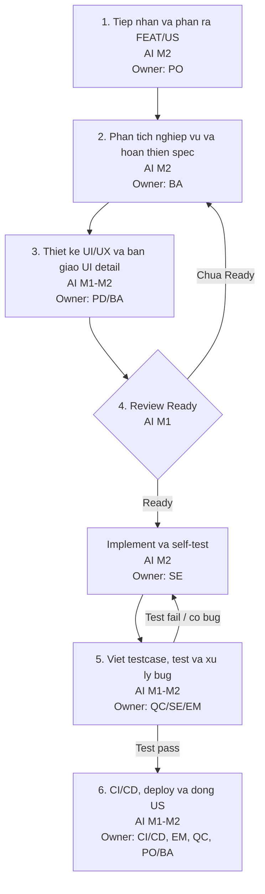

# Quy trinh Delivery FEAT/US trong Sprint co the hien muc do su dung AI

## Muc dich

Tai lieu nay mo ta quy trinh rut gon de delivery mot FEAT/US trong Sprint theo 6 buoc nho, tu luc tiep nhan yeu cau den khi hoan tat US. Moi buoc deu the hien ro vai tro chinh, dau ra, muc do su dung AI va nguoi xac nhan cuoi cung.

Nguyen tac chinh: **AI ho tro tang toc va chuan hoa dau ra, nhung khong thay the trach nhiem cua nguoi phu trach.**

## Thang muc do su dung AI

| Muc AI | Ten muc | Dinh nghia ngan gon |
|---:|---|---|
| Muc 0 | Chua dung AI | Con nguoi thuc hien thu cong 100%. |
| Muc 1 | AI ho tro thu cong | Dung prompt rieng le de hoi, goi y, review hoac viet nhap. |
| Muc 2 | AI theo template/workflow | Dung template, checklist, prompt chuan, agent hoac workflow de tao dau ra nhat quan. |
| Muc 3 | Tu dong hoa gan nhu hoan toan | He thong tu chay theo dieu kien dinh san, con nguoi giam sat va phe duyet. |

## 6 buoc delivery FEAT/US trong Sprint

| Buoc | Ten buoc | Hoat dong chinh | Vai tro chinh | Dau ra | Muc AI | Nguoi xac nhan |
|---:|---|---|---|---|---:|---|
| 1 | Tiep nhan va phan ra FEAT/US | PO tiep nhan yeu cau, lam ro problem, goal, scope, priority, dependency va phan ra FEAT/US du nho de dua vao Sprint. | PO | FEAT/US co muc tieu, pham vi, priority va owner ro rang. | Muc 2 | PO |
| 2 | Phan tich nghiep vu va hoan thien spec | BA nhan handoff tu PO, phan tich flow, rule, data, exception, edge case, prototype neu can va hoan thien `spec.md` voi AC ro rang. | BA | `spec.md` day du description, business rule, flow, data, AC Given/When/Then va edge cases. | Muc 2 | BA, PO neu can |
| 3 | Thiet ke UI/UX va ban giao UI detail | PD thiet ke UI/UX theo nghiep vu; BA va PD map UI voi AC, state, validation, message, empty/loading/error va ban giao `ui-detail.md`. | PD, BA | UI/UX design va `ui-detail.md` du de SE implement va QC test. | Muc 1-2 | PD, BA |
| 4 | Review Ready va implement | EM/SE/QC review US theo Definition of Ready; neu dat Ready, SE breakdown task, implement, self-test, review code va cap nhat tai lieu ky thuat neu can. | EM, SE, QC | US dat Ready; code dap ung scope va AC, self-test pass. | Muc 1-2 | EM, SE reviewer |
| 5 | Viet testcase, test va xu ly bug | QC viet testcase theo AC/rule, thuc hien test, raise bug co step/expected/actual/evidence; EM/SE review bug, SE fix va QC retest den khi pass. | QC, SE, EM | Testcase, test result, bug report neu co, bug da fix va retest pass. | Muc 1-2 | QC, EM/SE |
| 6 | CI/CD, deploy va dong US | CI/CD build, test, deploy dung moi truong, kiem tra log, smoke test neu can; EM/QC/PO/BA xac nhan Definition of Done va dong US. | CI/CD, EM, QC, PO/BA | Build/deploy pass, smoke test pass neu co, US dat Definition of Done. | Muc 1-2 | EM, QC, PO/BA neu can |

## Definition of Ready

US duoc xem la **Ready** khi:

- Description, goal va scope ro rang.
- AC co Given/When/Then.
- Business rule va dependency da duoc lam ro.
- UI/UX san sang neu co man hinh.
- SE hieu duoc huong implement.
- QC hieu duoc huong test.
- Estimate duoc.
- Khong con blocker lon.

## Definition of Done

US duoc xem la **Done** khi:

- Code da hoan thanh va merge.
- Build/CI pass.
- Self-test pass.
- Testcase pass.
- Bug critical/high da xu ly hoac co quyet dinh ro tu PO/EM.
- Deploy thanh cong len moi truong yeu cau.
- Smoke test pass neu co deploy.
- BA/PO xac nhan neu can.
- Tai lieu hoac tri thuc da cap nhat.

## Cach the hien muc do AI tren diagram

Dung ky hieu ngan gon tren tung buoc:

```text
1. Tiep nhan va phan ra FEAT/US [AI M2]
2. Phan tich nghiep vu va hoan thien spec [AI M2]
3. Thiet ke UI/UX va ban giao UI detail [AI M1-M2]
4. Review Ready va implement [AI M1-M2]
5. Viet testcase, test va xu ly bug [AI M1-M2]
6. CI/CD, deploy va dong US [AI M1-M2]
```

## Mermaid diagram tham khao



## Nguyen tac van hanh cuoi cung

- Khong dua US vao implement neu chua dat Definition of Ready.
- Khong dong US neu chua dat Definition of Done.
- Moi dau ra do AI ho tro tao ra phai co nguoi phu trach review va xac nhan.
- EM/Scrum Master theo doi blocker, DoR, DoD va cai tien quy trinh sau moi Sprint.
- Muc do su dung AI phai duoc the hien bang ky hieu cu the: `AI M0`, `AI M1`, `AI M2`, `AI M3`.
