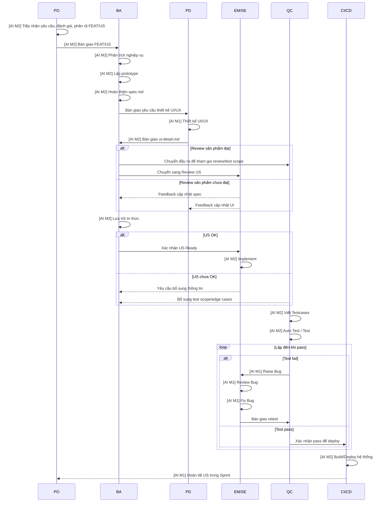

# Quy trình Delivery FEAT/US trong 1 Sprint

## 1. Mục đích

Tài liệu này mô tả quy trình tổng thể để team xử lý một FEAT/US trong Sprint, từ lúc PO tiếp nhận yêu cầu, BA phân tích nghiệp vụ, PD thiết kế UI/UX, EM/SE review và implement, QC kiểm thử, đến CI/CD deploy và hoàn tất US.

Quy trình này được dùng như **working agreement** cho team, giúp:

- Chuẩn hóa cách tiếp nhận, phân tích, thiết kế, phát triển, kiểm thử và deploy FEAT/US.
- Làm rõ trách nhiệm của từng vai trò trong Sprint.
- Giảm rủi ro US chưa rõ nhưng vẫn đưa vào implement.
- Tăng chất lượng đầu ra của BA, PD, SE, QC.
- Giảm bug, giảm rework và tăng khả năng dự đoán tiến độ.

---

## 2. Phạm vi áp dụng

Áp dụng cho các FEAT/US/Task được xử lý trong Sprint, bao gồm:

- New feature.
- Modify feature.
- Bug hoặc defect cần xử lý theo Sprint.
- Các hạng mục cần có phân tích nghiệp vụ, thiết kế UI/UX, implement, test và deploy.

---

## 3. Vai trò và trách nhiệm

| Vai trò | Trách nhiệm chính |
|---|---|
| PO | Tiếp nhận yêu cầu, đánh giá giá trị, phân rã FEAT/US, xác định priority và scope nghiệp vụ. |
| BA | Phân tích nghiệp vụ, lập prototype nếu cần, hoàn thiện tài liệu spec, AC và business rule. |
| PD | Thiết kế UI/UX, bàn giao UI detail, phối hợp với BA để đảm bảo thiết kế đúng nghiệp vụ. |
| EM / Scrum Master | Điều phối quy trình, thiết lập working agreement, theo dõi blocker, kiểm soát DoR/DoD, hỗ trợ team cải tiến sau Sprint. |
| SE | Review US về mặt kỹ thuật, breakdown task, implement, self-test, review/fix bug. |
| QC | Review testability của US, viết testcase, kiểm thử, raise bug, retest và xác nhận chất lượng. |
| CI/CD | Build, kiểm tra pipeline, deploy đúng môi trường, hỗ trợ rollback nếu phát sinh lỗi. |

---

## 4. Vai trò EM kiêm Scrum Master

Trong quy trình này, **EM kiêm nhiệm vai trò Scrum Master**. EM không chỉ quản lý kỹ thuật mà còn chịu trách nhiệm giúp team vận hành ổn định theo quy trình đã thống nhất.

### 4.1. Mục tiêu cần đạt

EM giúp team có quy trình làm việc rõ ràng, minh bạch trạng thái, giảm blocker, giảm rework và cải tiến liên tục sau mỗi Sprint.

### 4.2. Định nghĩa đạt

Được xem là đạt khi:

- Team hiểu rõ quy trình và trách nhiệm của từng vai trò.
- US trước khi implement đạt Definition of Ready.
- US trước khi đóng đạt Definition of Done.
- Blocker được phát hiện và xử lý sớm.
- Bug/rework giảm dần qua các Sprint.
- Có action cải tiến cụ thể sau Sprint Retro.

### 4.3. Giải pháp đề xuất

- Thiết lập working agreement cho team.
- Facilitate Planning, Daily, Review, Retro.
- Theo dõi flow xử lý US và blocker.
- Kiểm tra việc tuân thủ DoR/DoD.
- Tổng hợp vấn đề phát sinh và đề xuất cải tiến quy trình.

---

## 5. Mức độ tự động hóa / AI trong quy trình

Quy trình có bổ sung mức độ tự động hóa để team biết bước nào đang được AI hỗ trợ, bước nào vẫn cần con người quyết định và bước nào có thể nâng cấp thêm trong tương lai.

### 5.1. Thang mức độ tự động hóa

| Mức | Định nghĩa | Ý nghĩa vận hành |
|---:|---|---|
| 0 | Con người làm 100% | Chưa dùng AI/tool tự động hóa. Mọi hoạt động do người phụ trách thực hiện thủ công. |
| 1 | Con người dùng AI theo prompt thủ công | Người phụ trách tự đặt câu hỏi/prompt cho AI để hỗ trợ phân tích, viết, review hoặc gợi ý. Kết quả vẫn phải kiểm tra thủ công. |
| 2 | Dùng AI có Agent/Skill/Template/Workflow hỗ trợ | Có prompt mẫu, checklist, agent, skill hoặc workflow chuẩn để tạo đầu ra nhanh và nhất quán hơn. Người phụ trách vẫn review và chịu trách nhiệm cuối cùng. |
| 3 | Tự động hóa hoàn toàn | Hệ thống tự chạy end-to-end theo điều kiện định sẵn. Con người chủ yếu giám sát, xử lý ngoại lệ và phê duyệt khi cần. |

### 5.2. Nguyên tắc áp dụng AI

- AI là công cụ hỗ trợ, không thay thế trách nhiệm của PO, BA, PD, EM/SE và QC.
- Mọi đầu ra do AI sinh ra phải được người phụ trách review trước khi bàn giao.
- Không dùng AI để tự động quyết định scope, priority, acceptance, release hoặc đóng US nếu chưa có xác nhận của role chịu trách nhiệm.
- Các bước mức 2 nên có template/checklist/prompt chuẩn để giảm phụ thuộc kinh nghiệm cá nhân.
- Các bước có dữ liệu nhạy cảm cần tuân thủ quy định bảo mật trước khi đưa vào AI tool.

---

## 6. Quy trình tổng thể

| Bước | Hoạt động | Vai trò chính | Đầu ra | Mức độ tự động hóa / AI hiện tại |
|---:|---|---|---|---|
| 1 | Tiếp nhận yêu cầu, đánh giá và phân rã FEAT/US | PO | FEAT/US có mục tiêu, phạm vi, priority sơ bộ | Có - Mức 2 |
| 2 | Bàn giao FEAT/US cho BA | PO, BA | BA hiểu yêu cầu đầu vào | Có - Mức 2 |
| 3 | Phân tích nghiệp vụ | BA | Business flow, rule, data, logic nghiệp vụ | Có - Mức 2 |
| 4 | Lập prototype | BA | Prototype hoặc mô phỏng luồng nghiệp vụ nếu cần | Có - Mức 2 |
| 5 | Hoàn thiện tài liệu `spec.md` | BA | Spec nghiệp vụ đầy đủ, có AC và rule | Có - Mức 2 |
| 6 | Thiết kế UI/UX | PD | UI/UX design theo nghiệp vụ | Có - Mức 1 |
| 7 | Bàn giao UI `ui-detail.md` | PD, BA | Tài liệu UI đủ để SE implement và QC test | Có - Mức 2 |
| 8 | Review sản phẩm | BA, PD, QC, EM/SE nếu cần | Kết luận đạt/chưa đạt cho đầu ra BA/PD | Có - Mức 1 |
| 9 | Lưu trữ tri thức | BA, PD | Tài liệu được lưu đúng nơi, dễ truy vết | Có - Mức 2 |
| 10 | Review US | BA, EM/SE, QC | US đạt/chưa đạt Definition of Ready | Có - Mức 1 |
| 11 | Implement | SE | Code đáp ứng scope và AC | Có - Mức 2 |
| 12 | Viết Testcases | QC | Testcase theo AC, business rule và edge cases | Có - Mức 2 |
| 13 | Auto Test / Test | QC, CI nếu có | Kết quả test pass/fail | Có - Mức 2 |
| 14 | Raise Bug | QC | Bug có step, expected, actual, evidence | Có - Mức 1 |
| 15 | Review Bug | EM/SE, QC | Bug được xác nhận, phân loại và giao owner | Có - Mức 1 |
| 16 | Fix Bug | SE | Bug được fix và bàn giao retest | Có - Mức 1 |
| 17 | CI/CD | CI/CD, SE, QC | Build/deploy pass, smoke test nếu cần | Có - Mức 2 |
| 18 | Hoàn tất US trong Sprint | PO/BA, EM/SE, QC | US đạt Definition of Done | Có - Mức 1 |

---

## 7. Luồng xử lý chi tiết

### 7.1. Intake và phân rã FEAT/US

PO tiếp nhận yêu cầu, đánh giá giá trị nghiệp vụ, xác định mục tiêu, phạm vi và priority. Sau đó PO phân rã FEAT thành các US đủ nhỏ để BA có thể phân tích chi tiết.

**Đầu vào:**

- Yêu cầu nghiệp vụ.
- Mục tiêu sản phẩm.
- Priority hoặc định hướng release.

**Đầu ra:**

- FEAT/US đã được phân rã.
- Scope sơ bộ.
- Priority sơ bộ.
- Dependency sơ bộ nếu có.

---

### 7.2. Phân tích nghiệp vụ và hoàn thiện spec

BA nhận FEAT/US từ PO, làm rõ nghiệp vụ, phân tích business flow, rule, dữ liệu liên quan, exception và acceptance criteria.

Spec cần có tối thiểu:

- Description.
- Business goal.
- Business flow.
- Business rule.
- Data/input/output nếu có.
- Acceptance Criteria theo Given/When/Then.
- Exception/edge cases nếu có.
- Prototype nếu cần.

---

### 7.3. Thiết kế UI/UX và bàn giao UI

PD nhận tài liệu từ BA để thiết kế UI/UX. BA và PD cần phối hợp để đảm bảo thiết kế thể hiện đúng nghiệp vụ, đúng trạng thái và đúng rule.

UI detail cần có tối thiểu:

- Danh sách màn hình.
- Các state chính: default, loading, empty, error, success.
- Validation.
- Message hiển thị.
- Mapping giữa UI và AC.
- Responsive hoặc rule hiển thị nếu cần.

---

### 7.4. Review sản phẩm

Review sản phẩm là bước kiểm soát chất lượng đầu ra của BA/PD trước khi chuyển sang Review US.

#### Trường hợp đạt

- Tài liệu nghiệp vụ rõ.
- UI/UX rõ.
- Feedback đã được xử lý.
- Có thể chuyển sang Review US.

#### Trường hợp chưa đạt

- Trả lại BA/PD để bổ sung.
- Cập nhật lại spec hoặc UI detail.
- Review lại sau khi chỉnh sửa.

---

### 7.5. Review US

Review US nhằm xác nhận US đã đủ rõ để SE implement và QC chuẩn bị test.

#### Trường hợp US OK

- US đạt Definition of Ready.
- SE hiểu scope, approach và dependency.
- QC hiểu test scope.
- Có thể đưa vào implement.

#### Trường hợp US chưa OK

- Trả lại BA/PO/PD để bổ sung thông tin.
- Không đưa vào implement nếu còn blocker lớn hoặc chưa rõ AC.

---

### 7.6. Implement

SE thực hiện breakdown task, implement theo scope đã thống nhất, tự kiểm tra trước khi bàn giao QC.

Yêu cầu tối thiểu:

- Code đúng AC.
- Code chạy được trên môi trường dev/test.
- Có self-test.
- Không còn lỗi obvious.
- Cập nhật tài liệu kỹ thuật nếu cần.

---

### 7.7. Viết testcase và kiểm thử

QC viết testcase dựa trên AC, business rule, UI detail và các edge cases.

Testcase cần cover:

- Positive cases.
- Negative cases.
- Business rule.
- Validation.
- Permission nếu có.
- Integration nếu có.
- Edge cases quan trọng.

---

### 7.8. Bug loop

Nếu test fail, QC raise bug. EM/SE review bug để xác nhận nguyên nhân, phạm vi ảnh hưởng và owner xử lý. SE fix bug, sau đó QC retest. Vòng lặp tiếp tục đến khi pass.

Bug hợp lệ cần có:

- Title rõ ràng.
- Steps to reproduce.
- Actual result.
- Expected result.
- Evidence: ảnh, video, log hoặc data nếu có.
- Severity/Priority.
- Environment.
- Owner xử lý.

---

### 7.9. CI/CD và hoàn tất US

Khi US đã pass test, code được build/deploy qua pipeline CI/CD theo môi trường yêu cầu.

CI/CD cần đảm bảo:

- Pipeline pass.
- Deploy đúng môi trường.
- Có log kiểm tra.
- Có smoke test nếu cần.
- Có rollback plan với release quan trọng.

---

## 8. Mục tiêu, định nghĩa đạt và giải pháp đề xuất theo nhóm bước

| Nhóm bước | Mục tiêu cần đạt | Định nghĩa đạt | Giải pháp đề xuất |
|---|---|---|---|
| 1–2 | FEAT/US rõ mục tiêu, phạm vi và ưu tiên trước khi bàn giao | Có goal, scope, priority, dependency sơ bộ và owner rõ ràng | PO dùng checklist intake; EM hỗ trợ kiểm tra rủi ro scope/dependency tổng quan |
| 3–5 | Spec nghiệp vụ đủ rõ để PO/PD/SE/QC hiểu thống nhất | Có description, business rule, flow, data, AC Given/When/Then, edge cases nếu có | Chuẩn hóa `spec.md`; dùng checklist review nghiệp vụ |
| 6–7 | UI/UX đủ rõ để SE implement và QC test không phải suy đoán | Có screen, state, validation, message, empty/loading/error, mapping với AC | Dùng `ui-detail.md`; checklist design handoff; BA/PD review chéo |
| 8–9 | Đầu ra BA/PD được review và có thể truy vết | Review có kết luận; feedback đã cập nhật; tài liệu lưu đúng nơi | EM điều phối review; thống nhất nơi lưu trữ và checklist review |
| 10 | US đạt Ready trước khi implement | SE hiểu scope/approach/dependency; QC hiểu test scope; estimate được; không còn blocker lớn | Review US theo checklist DoR; EM/SE/QC cùng xác nhận |
| 11 | Code đáp ứng đúng scope và AC | Code chạy được, self-test pass, không lỗi obvious, tài liệu kỹ thuật cập nhật nếu cần | SE breakdown task, self-review, tuân thủ convention |
| 12–13 | Kiểm thử đủ phạm vi và phản ánh đúng chất lượng US | Testcase cover AC, business rule, positive/negative, edge cases; report rõ pass/fail | QC tham gia Review US sớm; viết testcase theo checklist coverage |
| 14–16 | Bug rõ nguyên nhân, xử lý đúng và giảm vòng lặp fix/retest | Bug có step, actual/expected, evidence, severity, owner; fix xong retest pass | Dùng bug template; EM/SE review bug; QC retest theo testcase |
| 17 | Deploy nhanh, ổn định và kiểm soát rủi ro | Pipeline pass, deploy đúng môi trường, có log, smoke test, rollback plan | Chuẩn hóa CI/CD; tách CI và CD; smoke test sau deploy |

---

## 9. Definition of Ready

US được xem là **Ready** khi thỏa các tiêu chí sau:

- Description rõ ràng.
- Mục tiêu nghiệp vụ rõ.
- Scope rõ: new, modify hoặc bug.
- AC có Given/When/Then.
- Business Rule đầy đủ.
- UI/UX sẵn sàng nếu có màn hình.
- Dependency rõ: API, data, service, bên thứ ba, quyền, config nếu có.
- SE hiểu được hướng implement.
- QC hiểu được hướng test.
- Estimate được.
- Không còn blocker lớn.

Nếu chưa đạt các tiêu chí trên, US chưa nên đưa vào implement.

---

## 10. Definition of Done

US được xem là **Done** khi thỏa các tiêu chí sau:

- Code đã hoàn thành và merge.
- Build/CI pass.
- Self-test pass.
- Testcase pass.
- Bug critical/high đã xử lý hoặc có quyết định rõ ràng từ PO/EM.
- Deploy thành công lên môi trường yêu cầu.
- Smoke test pass nếu có deploy.
- BA/PO xác nhận nếu cần.
- Tài liệu hoặc tri thức đã cập nhật.

---

## 11. Checklist theo vai trò

### 11.1. PO Checklist

- [ ] Yêu cầu có problem/mục tiêu rõ ràng.
- [ ] FEAT/US được phân rã đủ nhỏ.
- [ ] Priority rõ.
- [ ] Scope sơ bộ rõ.
- [ ] Dependency/ràng buộc nghiệp vụ lớn đã được nêu.
- [ ] Bàn giao FEAT/US cho BA có đủ context.

### 11.2. BA Checklist

- [ ] Description rõ ràng.
- [ ] Business flow đầy đủ.
- [ ] Business rule đầy đủ.
- [ ] AC có Given/When/Then.
- [ ] Có exception/edge cases nếu cần.
- [ ] Có prototype nếu nghiệp vụ phức tạp.
- [ ] Spec đã cập nhật theo feedback review.

### 11.3. PD Checklist

- [ ] UI thể hiện đúng nghiệp vụ.
- [ ] Có đủ màn hình/state chính.
- [ ] Có validation/message.
- [ ] Có empty/loading/error state nếu cần.
- [ ] Có mapping UI với AC.
- [ ] UI detail đủ để SE implement và QC test.

### 11.4. EM / Scrum Master Checklist

- [ ] Team hiểu rõ quy trình và trách nhiệm.
- [ ] Blocker được theo dõi và xử lý.
- [ ] Review US có kết luận rõ.
- [ ] US vào implement đạt DoR.
- [ ] US hoàn tất đạt DoD.
- [ ] Có action cải tiến sau Sprint.

### 11.5. SE Checklist

- [ ] Đã hiểu scope và AC.
- [ ] Đã xác định dependency kỹ thuật.
- [ ] Đã breakdown task nếu cần.
- [ ] Code đúng convention.
- [ ] Self-test pass.
- [ ] Tài liệu kỹ thuật cập nhật nếu cần.
- [ ] Bug được fix và bàn giao QC retest.

### 11.6. QC Checklist

- [ ] Đã hiểu AC và business rule.
- [ ] Testcase cover positive/negative/edge cases.
- [ ] Test result rõ pass/fail.
- [ ] Bug có step, expected, actual, evidence.
- [ ] Bug đã được retest sau khi fix.
- [ ] Kết quả test phản ánh đúng chất lượng US.

---

## 12. Bảng tự động hóa theo từng bước

| Bước | Hoạt động | Mức hiện tại | Định nghĩa đạt của tự động hóa | Giải pháp đề xuất để vận hành |
|---:|---|---|---|---|
| 1 | Tiếp nhận yêu cầu, đánh giá và phân rã FEAT/US | Mức 2 | AI hỗ trợ tóm tắt yêu cầu, xác định problem/goal/scope/dependency sơ bộ; PO review và chốt | Dùng intake template + AI checklist phân rã FEAT/US |
| 2 | Bàn giao FEAT/US cho BA | Mức 2 | AI hỗ trợ tạo handoff note rõ context, scope, priority, câu hỏi mở; BA xác nhận hiểu yêu cầu | Dùng mẫu bàn giao FEAT/US cho BA |
| 3 | Phân tích nghiệp vụ | Mức 2 | AI hỗ trợ phân tích flow, rule, data, edge case; BA kiểm tra và chuẩn hóa | Dùng BA analysis agent/template theo domain |
| 4 | Lập prototype | Mức 2 | AI hỗ trợ mô tả luồng, wireframe text hoặc prompt prototype; BA/PD xác nhận tính đúng nghiệp vụ | Dùng prompt tạo prototype/wireframe theo flow |
| 5 | Hoàn thiện tài liệu `spec.md` | Mức 2 | AI hỗ trợ tạo spec, AC Given/When/Then, business rule; BA chịu trách nhiệm chất lượng cuối cùng | Dùng `spec.md` template + checklist AC/rule |
| 6 | Thiết kế UI/UX | Mức 1 | AI hỗ trợ gợi ý layout, state, message; PD vẫn thiết kế chính và kiểm soát design system | Dùng AI như công cụ tham khảo, chưa tự động hóa workflow thiết kế |
| 7 | Bàn giao UI | Mức 2 | AI hỗ trợ tạo `ui-detail.md`, mapping UI với AC/state/validation; PD/BA review | Dùng handoff template cho UI detail |
| 8 | Review sản phẩm | Mức 1 | AI hỗ trợ checklist review và phát hiện thiếu sót; quyết định đạt/chưa đạt do PO/BA/PD/EM/QC | Dùng prompt review tài liệu/UI theo checklist |
| 9 | Lưu trữ tri thức | Mức 2 | AI hỗ trợ tóm tắt, đặt tên, phân loại, tạo index tri thức; team lưu đúng nơi | Dùng template summary + tagging/index |
| 10 | Review US | Mức 1 | AI hỗ trợ kiểm tra DoR, AC, dependency, testability; EM/SE/QC xác nhận Ready | Dùng checklist DoR có AI hỗ trợ review |
| 11 | Implement | Mức 2 | AI hỗ trợ sinh code mẫu, unit test, refactor, giải thích code; SE review và chịu trách nhiệm | Dùng coding assistant theo convention và checklist self-review |
| 12 | Viết Testcases | Mức 2 | AI hỗ trợ sinh testcase từ AC/rule; QC review coverage và chỉnh case thực tế | Dùng testcase generator theo Given/When/Then |
| 13 | Auto Test / Test | Mức 2 | AI hỗ trợ tạo test script, phân tích report/log; QC xác nhận kết quả | Kết hợp test automation + AI phân tích report |
| 14 | Raise Bug | Mức 1 | AI hỗ trợ chuẩn hóa nội dung bug; QC vẫn xác nhận step/evidence/severity | Dùng bug template có AI hỗ trợ viết mô tả |
| 15 | Review Bug | Mức 1 | AI hỗ trợ phân tích nguyên nhân/ảnh hưởng; EM/SE quyết định owner và hướng xử lý | Dùng prompt review bug theo log/evidence |
| 16 | Fix Bug | Mức 1 | AI hỗ trợ gợi ý hướng fix; SE kiểm tra, sửa code và chịu trách nhiệm chất lượng | Dùng AI để debug nhưng bắt buộc self-test/retest |
| 17 | CI/CD | Mức 2 | Pipeline tự chạy build/deploy/test ở mức đã cấu hình; người phụ trách kiểm tra log và xác nhận | Chuẩn hóa pipeline, log, smoke test, rollback checklist |
| 18 | Hoàn tất US trong Sprint | Mức 1 | AI hỗ trợ tổng hợp trạng thái/tài liệu; PO/BA/EM/QC xác nhận DoD | Dùng checklist DoD + summary tự động |

### 12.1. Mục tiêu nâng cấp tự động hóa

| Nhóm bước | Mức hiện tại | Mức mục tiêu | Điều kiện để nâng cấp |
|---|---:|---:|---|
| 1–5: Intake, phân tích, spec | 2 | 2–3 | Có template chuẩn, dữ liệu đầu vào ổn định, checklist review rõ, có cơ chế trace thay đổi |
| 6–7: UI/UX và handoff | 1–2 | 2 | Có design system, component library, UI handoff template, mapping AC–UI rõ |
| 8–10: Review sản phẩm và Review US | 1 | 2 | Có DoR checklist, review checklist, rule đánh giá đạt/chưa đạt rõ ràng |
| 11: Implement | 2 | 2 | Duy trì human review; không nên tự động hóa hoàn toàn vì rủi ro chất lượng và bảo mật |
| 12–13: Testcase và test | 2 | 2–3 | Có test automation ổn định, test data, môi trường test ổn định, report chuẩn |
| 14–16: Bug loop | 1 | 2 | Có bug template chuẩn, log/evidence đầy đủ, phân loại severity/priority rõ |
| 17: CI/CD | 2 | 3 | Pipeline ổn định, rollback tự động, smoke test tự động, quality gate rõ |

---

## 13. Mermaid diagram tham khảo

Diagram dưới đây thể hiện thêm mức độ tự động hóa hiện tại ngay trên từng bước chính. Ký hiệu `AI M1/M2` tương ứng với thang mức độ tự động hóa ở mục 5.

---

## 14. Nguyên tắc vận hành

- Không đưa US vào implement nếu chưa đạt Definition of Ready.
- Không đóng US nếu chưa đạt Definition of Done.
- QC nên tham gia sớm từ Review US để xác định test scope.
- BA/PD phải cập nhật tài liệu sau feedback review.
- SE phải self-test trước khi bàn giao QC.
- Bug phải có đủ bằng chứng trước khi giao fix.
- EM/Scrum Master theo dõi blocker và cải tiến quy trình sau mỗi Sprint.
- CI/CD cần có log, kiểm tra môi trường và rollback plan với release quan trọng.
- Mọi bước có AI hỗ trợ phải có người chịu trách nhiệm review và xác nhận đầu ra.
- Mức độ tự động hóa phải được cập nhật sau mỗi Sprint/Retro nếu quy trình hoặc tool thay đổi.
